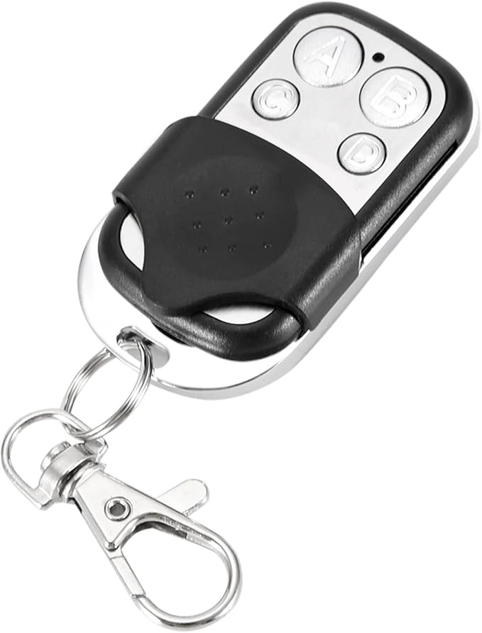

## Auto Pilot

These example sketches are for the NMEA 2000 autopilot.  The autopilot consists of a 433mhz receiver that can be used to control the NMEA 2000 autopilot using the key FOB shown below (or equivalent) and the IoT MQTT App on your phone.  **Note:** the NMEA 2000 aout pilot code has only been tested with a RayMarine EV1 autopilot.  The auto pilot MQTT phone app connects to the SeaData 2000 via WiFi.  If your boat already has a WiFi network, then the SeaData 2000 can be configured to connect to that network. If you don't have a WiFi network, the ESP32 can be configure in Access Point mode.  This will create a stand-alone local WiFI network that you can connect to with your phone(s).  If you launch the IoT MQTT app and configure it (see the MQQTTSettings folder) there is an "AutoPilot" panel that you can use to control your autopilot remotely.

  

## RCSwitchSend

This example sketch is used to program the key fob pictured above.  It uses the Serial Monitor command line to program the FOB.  The commands are as follows:
- 'N' prompts to enter starting code number
- 'A' - continuously transmits code number
- 'B' - transmits code number + 1
- 'C' - transmits code number + 2
- 'D' - transmits code number + 3
- 'E' - transmits code number + 4
- 'F' - transmits code number + 5

**Special NOTE!** You must solder on an antenna to the 433mhz transmitter module in order to program the FOB.  The FOB's receiver is not very sensitive and you will not have any luck programming a FOB without an antenna.

They're many FOBs that look a like.  At the time of this writing, we've seen 2 different types of FOBs.  They look identical but one distinguishing feature we've seen is the buttons.  There are 2 styles of buttons, flat and pan head.  In order to program the buttons, you must clear out the existing codes.  The method of clearing the codes seems to be different for the 2 styles of buttons.

For pan head style FOBs, start by holding A & B buttons at the same time until the LED flashes.
Next, release only the B button and press it 3 times.  The LED should blink.
Release the A button.
Now when you press any of the A-D buttons, the LED will not light.  The pan head type FOB is now ready for programming.

For flat head button style FOBs, press the A & B buttons at the same time until the LED starts flashing continuously.
Release both the A & B buttons.
Now when you press any of the A-D buttons, the LED will light, but for less than one second.
The flat head type FOB is now ready for programming.
  
Programming the FOB's is pretty much the same for each type that we've seen.  Enter your starting code number using the "n" command from the Serial Monitor (Ctrl + Shift + M from the Arduino IDE or else Tools / Serial Monitor). For example, enter 14000 for the starting code number.  Use the Serial Monitor to select say "a" to program the A button of the FOB.  The serial monitor will repeatedly display "Sending code key A code 14000".  Hold the FOB within 1 inch (3 cm) of the transmitter antenna. Hold down the 'A' button until the LED on the FOB blinks continuously.  Usually takes about 5 seconds.  Now when you press the 'A' button, the LED should blink continously.  Enter 'B' from the serial monitor, present the FOB and press and hold the 'B' button.  Repet for the C and D buttons.

