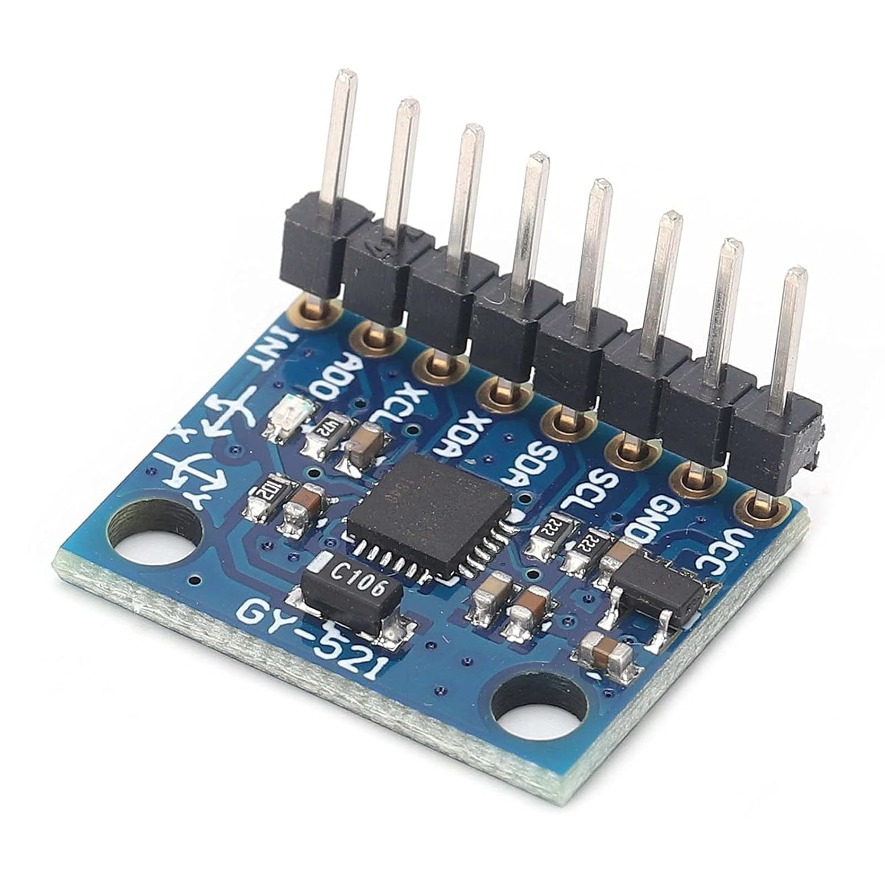
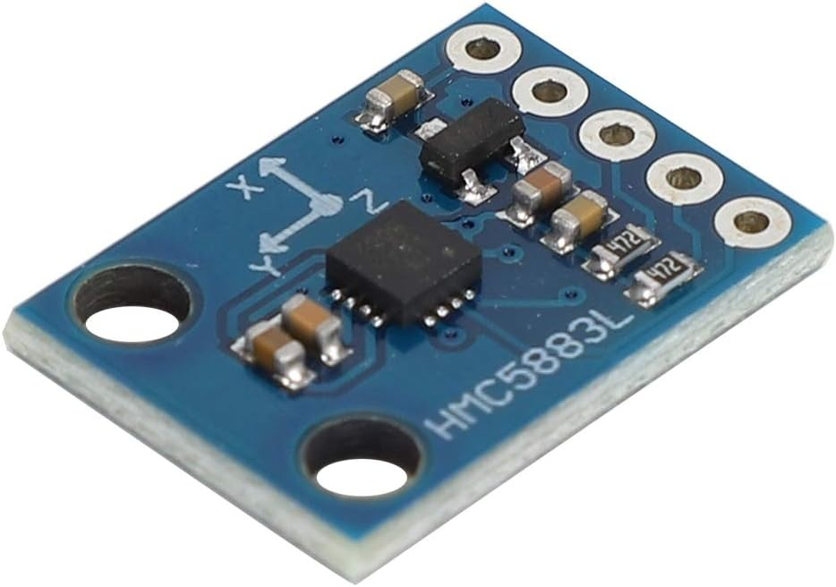

## Compass and Gyro

div align="left" markdown="1">
  
  

The SeaData2000 board has sockets for a MPU-6050 3 axis accelerometer with 6 DOF gyro and a HMC5883L compass module.  
## Magnetometer Calibration
The calibration procedure for the magnetometer was derived from this YouTube [video](https://www.youtube.com/watch?v=MinV5V1ioWg&t=94s)  Instead of using the Python script mentioned in the YouTube link, we've provided a C# program that makes it a little easier to perform the calibration procedure and has some features that the python script doesn't have. You can either compile the C# source code using Visual Studio or else download the compiled executable from [here](https://github.com/randyb128/SeaData2000/tree/main/Examples/Compass/RecordData/bin/Debug) If you choose to go the source code route, and don't already have Visual Studio, you can download the community edition for free.  The ReadData C# application can save both magnetometer readings or gyro readings.  

 
> \[!IMPORTANT]
>

