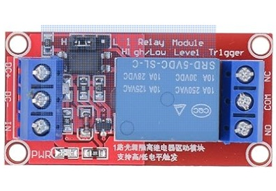

## Inputs / Outputs

  

The SeaData2000 board provides the user with 2 relay outputs which the contacts are rated at 10 amps 30 volts DC.  The relays are driven by a low signal on GPIO32 and GPIO32.  We've also provided a diagnostic LED on which is drvien by a high signal on GPIO2.  

There are 4 voltage divider inputs with a common terminal.  The voltage divider circuit consists of a 1.5k and 10k resistor and a 3.3 volt zener diode to protect the processor input.  If you provide 12 volts, the processor input voltage will be approximately 1.5 volts or mid-scale.  The voltage divider circuit can be used for tank level monitoring or just straight 12 or 24 volt inputs.  The example source code can be used to test the inputs and outputs SeaData2000 board.

## InpOutpTest Example

This sketch uses the serial console to test the inputs and outputs.  It displays the voltage and raw counts of the 4 inputs every 500ms.  It also takes input from the serial console using these commands:
'R' - turn on/off red LED
'1' - turn on/off relay 1
'2' - turn on/off relay 2

## InpOutMQTT Example

This sketch uses the IoT MQTT phone app to test and inputs and outputs.  Open the IoT MQTT app and select the Input/Output panel.  You can publish to:
- output/led/chan0  payload "true" turns on LED otherwise off
- output/relay/chan0 payload "true" turns on 1st Relay otherwise off
- output/relay/chan1 payload "true" turns on 2nd Relay othrwises off

You can subscribe to:
- input/volts/chanX - sends channel X input in volts where X is 0-3
- input/raw/chanX   - sends channel X input in raw readings where X is 0-3

