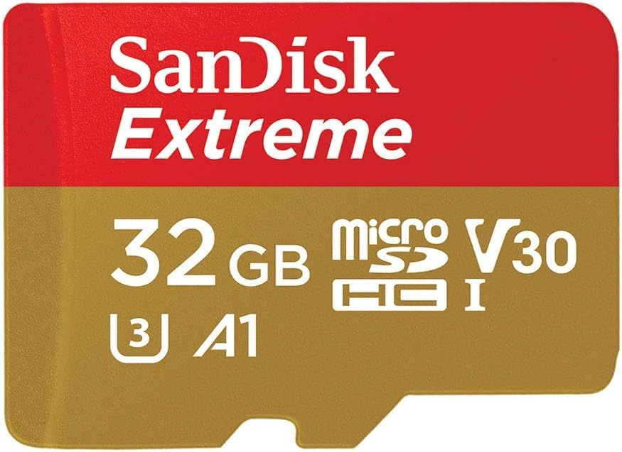

## SDRam

  

The SeaData2000 board provides a SPI interface to a micro SD card slot.  The I/O pin wiring is as follows:
- MISO GPIO12
- MOSI GPIO13
- CLK  GPIO14
- CS   GPIO15

We haven't used the card as of yet in any sketch in an actual boat, but the hardware has been tested and is functioning properly.  
**Special Note**:exclamation: when programming the ESP32 you'll need to remove the SD card as some lines are shared.

## SDRamTest Example

We've provided this example sketch to prove the SDRam card and the hardware.  This sketch uses the built-in ESP32 SD.h card library which I believe is limited to Fat32 which has a maximum capacity of 32gb and has some other limitations like 8.3 filenames (8 character name and 3 character extension).  You may want to checkout the mySD library [here](https://github.com/sfambach/MySD) for a more robust version of SD.h

If you're going to use the SDRam card in your watercraft, we'd recommend a dab of hot glue to hold the card into the slot once you've completed programming of the SeaData2000 board.

