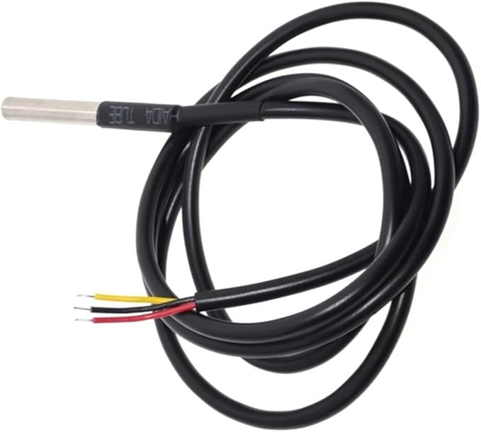

# SeaData2000 Temperature Examples
The SeaData2000 board supports multiple Dallas DS18B20 temperature probes.  DS18B20 probes like the one's pictured below are readily available from Amazon or other offshore suppliers usually for around $2-3 USD each.  There are 2 sets of screw terminals for 2 individual temperature probes but temperature probes can be wired in parallel.  The temperature probes require no extra modules to be installed.   

  

# Source Code
**Notes for all** 
- all the examples requires at least one temperature probe to be attached to one of the 2 sets of screw terminals.
- there is a dependency of the DS2482 library by Joe Young and our DSTemp library.  This should already be in your Arduino Home\Libraries folder.
- temperature readings default to Celsius degrees but you can set "fahrenheit" bool to "true" if desired in the DSTemp instantiated class.
- device serial numbers are sorted so they will always be in the same order no matter how they maybe discovered.  This can be overidden by setting "sortList" to "false" in the DSTemp instantiated class.
- the DSTemp temperature library source code supports up to 6 temperature probes but that can easily be changed in the code by editting the $Your Arduino Home Dir\libraries\DSTemp\DSTemp.h and increasing the MAXID value. 
- the DSTemp SerialNum(int ndx) method will return a human readable value of the devices serial number in hexadecimal of the ndx device id.
- floating point values of the temperature to 2 decimals is returned in the "ftemps" array of the DSTemp class.
- the DSTemp "lastError" enum should be checked for a value of zero after calling "begin()" of the DSTemp class to ensure that the DS2482 bridge and the DS18B20 temperature device are functioning properly.
- the DSTemp "numTemp" property is the number of discovered temperature devices.

**TempSimple**
  - this test example display on the serial monitor console the 
