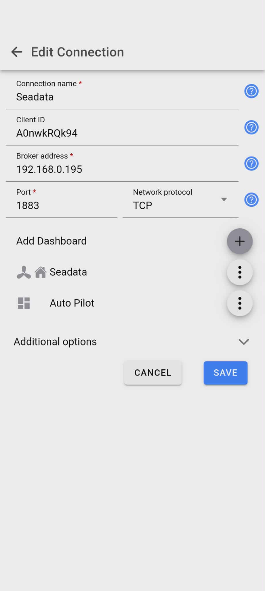

  

# SeaData2000 ⛵
Source code repository for the SeaData 2000 marine interface board
## What is SeaData2000
SeaData2000 is a NMEA 2000 capable interface board based on an Arduino ESP32 module.  The board provides many pluggable features that can be used in a multitude of applications on any vessel.
## History 
The board development stems from an issue with a brand new RayMarine Element 12S GPS chart plotter.  Apparently this chart plotter has a known issue where the internal GPS signal appears to drop out unexpectedly.  If for instance, if you had selected a waypoint heading, the unit will occasionlly claim the GPS signal is lost and the heading is gone!  This issue would happen many times per day and is very annoying and even outright dangerous at times.  Searching the web, many users have this same issue with the Element series of chart plotters from RayMarine.  Raymarine's solution is to purchase a NMEA 2000 GPS antenna and use that NMEA 2000 data as the source for the 12S as opposed to the internal GPS.  The Raymarine NMEA 2000 GPS module solution is the RS150 and is over $300 USD and needs to be mounted and wired to NMEA2000 bus.  We decided that we could build a NMEA 2000 GPS device that could also be used for other purposes on the boat.  We decided to add a one wire bus to measure some temperatures as well as some relays to control devices.  Another nice to have would be a remote control for the auto-pilot so we added a 433mhz receiver / transmitter pair.
## Design Concepts
The SeaData2000 is based on an ESP32 WROOM Arduino module.  This provides both Bluetooth BLE and WiFi capabalities.  In the design, the idea was to keep costs and power consumption down.  You can select which pluggable modules you want to use for your application depending on your design requirements.  The modules are easy to find from various North American or off shore sources. This allows the SeaData2000 to be very efficient from a power standpoint has you only populate the modules you need for your application.  The main processor module is an ESP32 WROOM.  The ESP32 with it's WiFi capabilities allows for use of MQTT to communicate with an MQTT client app as well as a Victron Cerbo GX to display data on Node-Red.  The device is not powered from the NMEA 2000 bus but instead is fully isolated and will not cause issues with load or ground loops.
Example code for the SeaData2000 NMEA interface is based on the library by Timo Lappalainen found [here](https://github.com/ttlappalainen/NMEA2000)

## Arduino IDE Quick Start Guide :bulb:
1. Install [Arduino IDE](https://www.arduino.cc/en/software)
2. Install [Arduino lastest ESP32](https://docs.espressif.com/projects/arduino-esp32/en/latest/)
3. Copy all folders in to your Arduino library folder (e.g. C:\Users\YourLoginName\Documents\Arduino\libraries)
4. Open ArduinoIDE,  

> \[!IMPORTANT]
>
> When opening the Arduino IDE, you may be prompted that there are new libraries that can be updated.  Please do not click update.  There is no guarantee that it can be compiled, run, etc..

## Debugging Code :debug:
Code can be debugged using the built-in Serial Monitor of the Arduino IDE and using the Serial.print() and Serial.println() methods. This works well when connected to the ESP32 via a micro USB cable but you can also use MQTT to debug.  MQTT is  a very light weight publish/subscribe machine to machine protocol.  In our case, we'll use the built-in WiFi of the ESP32 on the SeaData2000 board to communicate with an app on our phone running an MQTT client.  There are many different clients available but one of the best one's we've found is "IoT MQTT Panel".  This is available for both Android and iPhone and is pretty simple to setup and use.  There's a free version with advertisements and a Pro version which is ad free.  One of the nice features of this version is, you can import preconfigured settings.  We've gone ahead and setup panels for debugging all of the different modules that are available on the Seadata2000 board.  There's even a panel to control a NMEA2000 auto-pilot such as a Raymarine Evolution.  You can download the pre-configured settings here 

| Syntax | Description |
| ------ | ----------- |

